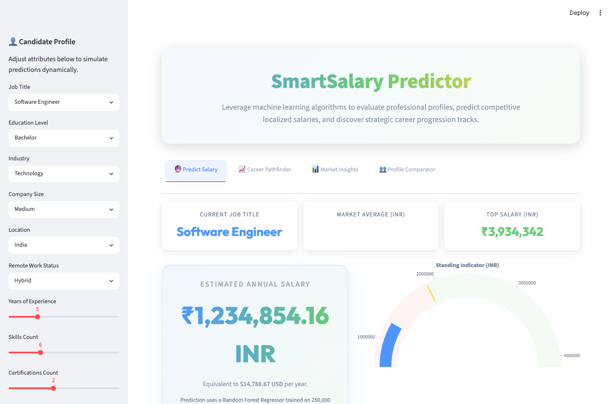
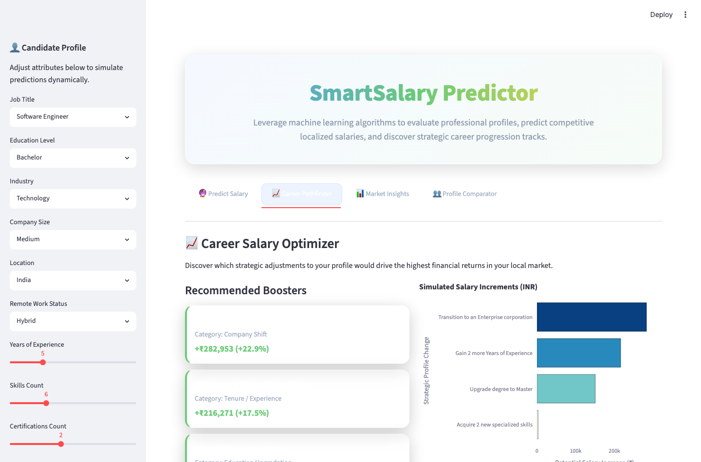
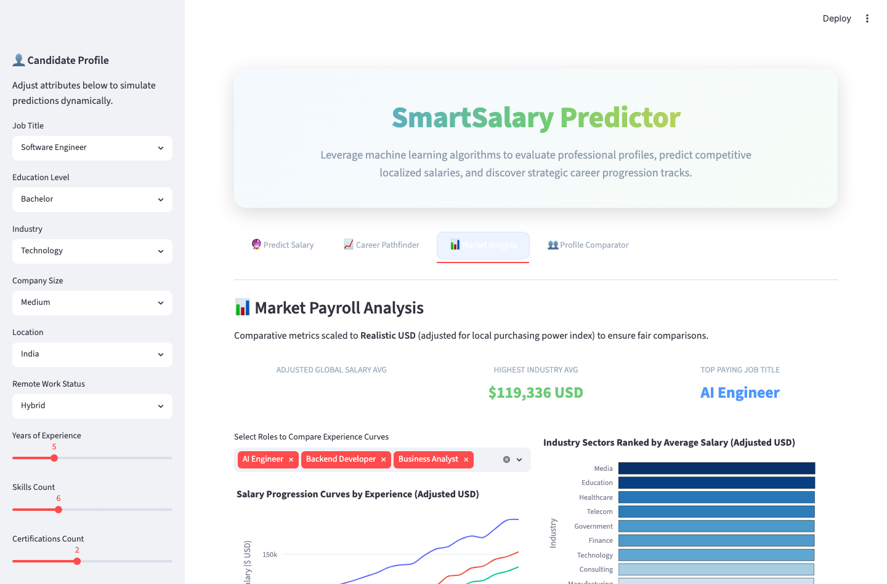
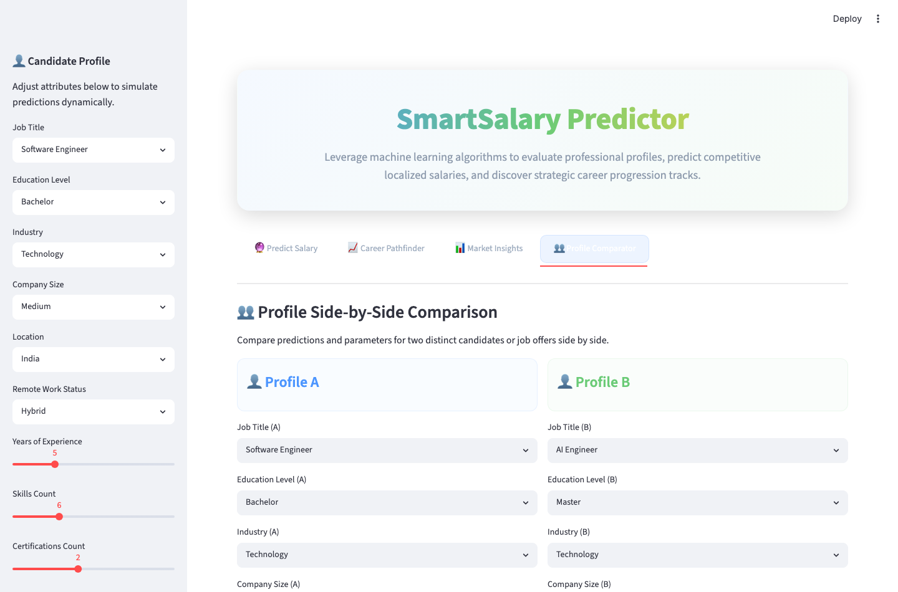

# 💼 SmartSalary Predictor & Analytics

🚀 A premium, machine-learning-powered Streamlit web application that predicts competitive, localized employee salaries and provides strategic career path optimization, side-by-side profile comparisons, and global market insights.

---

## 📌 Overview

**SmartSalary Predictor** leverages a trained Random Forest Regressor to analyze professional candidate profiles and estimate fair annual salaries. It features real-time dynamic market adjustments based on location, purchasing power index, exchange rates, and non-linear experience curves (such as a steeper career boost curve for markets like India). 

Built using **Python**, **Streamlit**, **Scikit-learn**, and **Plotly**, the application features a luxury glassmorphic dark user interface with custom CSS styling and responsive micro-interactions.

---

## 📁 Project Structure

The codebase is organized as follows:

```plaintext
SmartSalary-Predictor/
├── README.md                           # Project documentation
├── screenshots/                        # App screenshots
│   ├── predict_salary.png              # Salary prediction & gauge dashboard
│   ├── career_pathfinder.png           # Career optimizer recommendations & charts
│   ├── market_insights.png             # Market payroll analytics & trends
│   └── profile_comparator.png          # Side-by-side profile comparator dashboard
│
└── Employee-Salary-Prediction/         # Core application directory
    ├── app.py                          # Streamlit application with custom dark UI
    ├── requirements.txt                # Python package dependencies
    ├── train_and_save.py               # Pipeline script for training & saving model
    ├── train_model.py                  # Sandbox script for testing model accuracy
    ├── salary_model.joblib             # Trained Random Forest Regressor model
    ├── label_encoders.joblib           # Serialized label encoders for categories
    │
    └── dataset/
        └── salary_prediction.csv       # Training dataset with 250,000+ employee records
```

---

## ✨ Key Features

The app is divided into four highly interactive modules:

1. **🔮 Predict Salary Dashboard**
   * Instant real-time salary prediction based on 9 core profile attributes.
   * Compares estimated annual salary with local market average and top-tier scales.
   * Displays an interactive **Plotly Gauge Standing Indicator** visually plotting the candidate's compensation position.
   * Shows local currency scaling (e.g. ₹ INR, $ USD, £ GBP, € EUR) and USD equivalents.

2. **📈 Career Pathfinder**
   * A simulated career salary booster identifying the highest-ROI professional upgrades.
   * Analyzes impact of acquiring advanced degrees (e.g. Master's, PhD), professional certifications, additional skills, remote transition, tenure, and changing company size.
   * Features a horizontal bar chart mapping simulated increments and percentage increases.

3. **📊 Market Insights & Payroll Analytics**
   * Global payroll metrics adjusted for location-based purchasing power indexes.
   * **Progression Curves**: Dynamic spline line charts representing salary growth over years of experience.
   * **Industry Valuation**: Ranks sectors (Technology, Healthcare, Finance, etc.) by average salary.
   * **Education Valuation & Remote Premium**: Charts detailing financial returns of advanced degrees and remote vs. hybrid/on-site work arrangements.

4. **👥 Profile Comparator**
   * Side-by-side candidate comparison simulator.
   * Parallel selection of all attributes for Profile A and Profile B.
   * Renders salary comparison cards and an interactive bar chart highlighting the variance.

---

## 🛠️ Tech Stack

* **Language**: Python 3.9+
* **Web UI Framework**: Streamlit (with embedded HTML/CSS styling)
* **Data & Analytics**: Pandas, NumPy, Plotly Express & Graph Objects
* **Machine Learning**: Scikit-learn (RandomForestRegressor, LabelEncoder), Joblib

---

## 📸 Screenshots

### 1. Salary Prediction Dashboard


### 2. Career Pathfinder


### 3. Market Insights


### 4. Profile Comparator


---

## 🚀 Setup & Execution Instructions

### Prerequisites
Make sure you have Python 3 installed. You can check your version using:
```bash
python3 --version
```

### 1. Clone the Repository
```bash
git clone https://github.com/RishavPal143/Salary-Predictor.git
cd SmartSalary-Predictor-main
```

### 2. Install Dependencies
Navigate to the app directory and install requirements:
```bash
cd Employee-Salary-Prediction
pip install -r requirements.txt
```

### 3. Model Training (Optional)
If you want to retrain the model or regenerate the files `salary_model.joblib` and `label_encoders.joblib`:
```bash
python3 train_and_save.py
```

### 4. Run the Streamlit Application
Start the Streamlit server:
```bash
streamlit run app.py
```
Or run the module directly:
```bash
python3 -m streamlit run app.py
```
Open the provided URL (default `http://localhost:8501`) in your browser to interact with the app.
